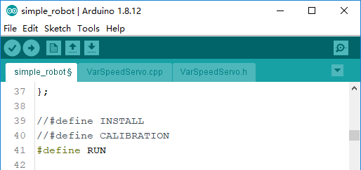
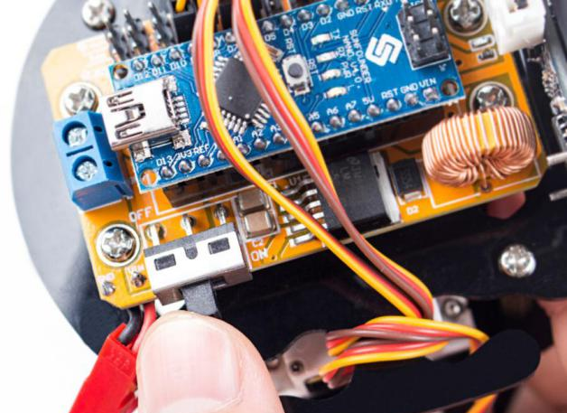
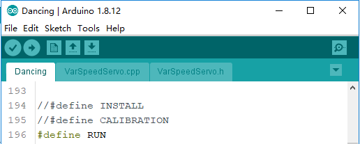
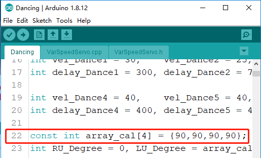

.. note::

    Hello, welcome to the SunFounder Raspberry Pi & Arduino & ESP32 Enthusiasts Community on Facebook! Dive deeper into Raspberry Pi, Arduino, and ESP32 with fellow enthusiasts.

    **Why Join?**

    - **Expert Support**: Solve post-sale issues and technical challenges with help from our community and team.
    - **Learn & Share**: Exchange tips and tutorials to enhance your skills.
    - **Exclusive Previews**: Get early access to new product announcements and sneak peeks.
    - **Special Discounts**: Enjoy exclusive discounts on our newest products.
    - **Festive Promotions and Giveaways**: Take part in giveaways and holiday promotions.

    👉 Ready to explore and create with us? Click [|link_sf_facebook|] and join today!

Example
=======

Here, we provide you with two sample programs to play Sloth:

Simple Robot
------------

In this code we write mobile obstacle avoidance for the robot. After the program is burned, sloth will go straight ahead. If it senses an obstacle ahead, it will step back and turn to find a new direction.

Open the program ``simple_robot.ino`` under the path of ``DIY_4-DOF_Robot_Kit_-_Sloth\Code\simple_robot``. 

(This is also the program what we use to install and calibrate the servo.)
Go to Line 39 again, set ``#define RUN`` as able and disable the other two, then upload the code to the SunFounder Nano board.

After burning successfully, unplug the USB cable and slide the power switch to ON.

You will see the robot moving forward. When encountering an obstacle, it will make a turn and then go forward again.

Dancing
-------

In this code, we write the basic actions of  sloth and compose them into a dance. 
Open the program ``Dancing.ino`` under the path of ``DIY_4-DOF_Robot_Kit_-_Sloth\Code\Dancing``. 
Go to Line 196, select the ``RUN`` function by rectifying ``#define``.

After burning successfully, unplug the USB cable and press the power button on the servo control board. You will see the robot dancing. 

.. note:: The program also needs to be calibrated in the same way as **Servo CALIBRATION Test** in **Assembly**. If there has been a precise calibration, you can modify the parameters in line 22 directly.

